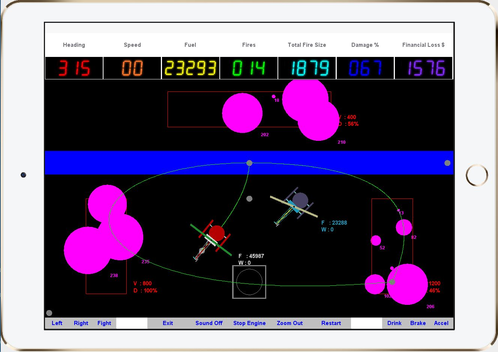

# Hornet HFD

# Game Description
Hornets HFD is set in the near feature where an explosion of brush fires is wreaking havoc in our community. Fires are spontaneously erupting all over campus. You will pick up water from the American River and use that water to fight fires throughout the campus. You will have to make repeated trips back to the river to get more water and the fires will continue to grow in size until they are fully extinguished. You also need to avoid other objects, such as the a NPC helicopter, and manage your fuel and other resources carefully in order to win the game.
The player has partial control on the NPC helicopter, where you can only decide which fire the NPC helicopter should prioritize. However, the player will have no control of how the NPC helicopter extinguishes the fires. It is possible to crash against the NPC helicopter, which loses the game. However, the NPC helicopter has multiple strategies, including an avoidance strategy that attempts to prevent a crash.

# Game Objective
To win the game, the player needs to extinguish every single fire, return to the helipad with enough fuel, and completely stop the engine. Note that new fires may randomly spawn, with an increased probability the more fires are present. Also, fuel is finite and once the player runs out, the game ends.
The game includes a scoring system that is based on how much damage the buildings underwent. The lower the damage, the higher the score. This means that for a higher score, the player needs to be quick at extinguishing fires, but also be smart on which building to prioritize.

# How to Play

The following keybinds are specifically for the player helicopter:

Keybind | Button | Description
'←' | Left | Rotate helicopter left by 15°
'→' | Right | Rotate helicopter right by 15°
'↑' | Accel | Increase helicopter's speed
'↓' | Brake | Decrease helicopter's speed
'f' | Fight | Attempt to fight fire by dumping water
'd' | Drink | Fill helicopter's water tank
's' | Start Engine/Stop Engine | Starts and stops the helicopter engine
'z' | Zoom Out/Zoom In | Applies the respecting zoom instruction.
'r' | Restart | Restarts the game
'Q' | Exit | Quits the game

To decide which fire the NPC helicopter must extinguish, you will need to require on touch controls. With your mouse, select the fire you want to extinguish. If successful, the NPC will create a route towards it. This action can be done at any time, even when the NPC is on its path towards the fire, while its filling its water tank, or while its dumping water.
